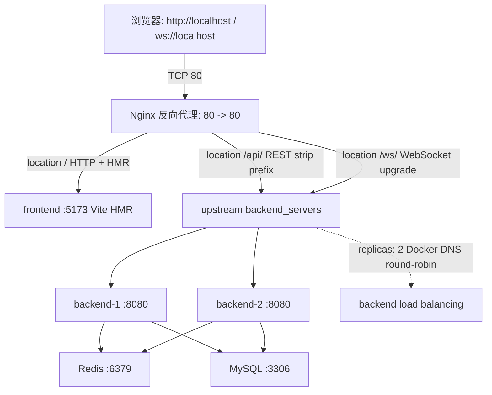

# 08 - 网络结构文档（Nginx 模式）

本文档描述 Cocanvas 在 `docker-compose up` 启动后的实际网络拓扑、流量走向，以及每一段链路的配置文件落点。当你想改一条路由、加一个端点、扩一个后端实例时，对照本文档就能定位需要改哪些文件。

---

## 一、拓扑概览




所有外部入口只有 Nginx 的 80 端口。前端、后端、Redis、MySQL 都在 Docker 内部网络里通过服务名互访，**容器端口不暴露到宿主**（Redis/MySQL 暴露端口仅为方便宿主直接连库调试，不在生产链路上）。

---

## 二、关键路由与流量走向

Nginx 的 `server { listen 80 }` 块按 path 分流，三条 location 互不重叠：

| 路径前缀 | 目标 upstream | 用途 | 关键行为 |
|---|---|---|---|
| `/` | `frontend_servers` → `frontend:5173` | 加载 React 页面 + Vite HMR | 带 `Upgrade` 头转发，HMR 的 WebSocket 才能建立 |
| `/api/` | `backend_servers` → `backend:8080` | REST API | `proxy_pass` 末尾带 `/`，**Nginx 自动剥掉 `/api/` 前缀**再转发 |
| `/ws/` | `backend_servers` → `backend:8080` | WebSocket 长连接 | 带 `Upgrade: $http_upgrade` 头、`proxy_read/send_timeout 3600s` |

### 路径剥离的实际效果

前端请求 `/api/health` → Nginx 转发为 `/health` → 命中 [HealthController.java](src/backend/java/src/main/java/com/cocanvas/controller/HealthController.java) 的 `@GetMapping("/health")`。

前端请求 `/api/rooms` → Nginx 转发为 `/rooms` → 命中 [RoomController.java](src/backend/java/src/main/java/com/cocanvas/controller/RoomController.java) 的 `@RequestMapping("/rooms")`。

> **后端控制器一律写无前缀的路径**（`/health`、`/rooms`），不要写 `/api/health`。"加 `/api/` 前缀"这件事由 Nginx 统一负责。

`/ws/` 路径没有剥离（`proxy_pass http://backend_servers` 末尾**不带** `/`），所以前端 `ws://localhost/ws/echo` 透传到后端的 `/ws/echo`，命中 [WebSocketConfig.java](src/backend/java/src/main/java/com/cocanvas/config/WebSocketConfig.java) 注册的 handler。

### 后端负载均衡

`upstream backend_servers { server backend:8080; }` 看起来只有一个 server，但 docker-compose 里 `backend.deploy.replicas: 2` 启动了两个实例，Docker 内置 DNS 会把 `backend` 解析成两个 IP 的轮询，Nginx 默认 round-robin 策略自动负载均衡。

⚠️ **当前后端尚未做分布式会话同步**：WebSocket 连接落在哪个实例上，房间状态就只在那一个实例里。多节点协同要等阶段四接入 Redis Pub/Sub 后才能跑通。

---

## 三、配置文件清单

下表把"每一条链路属性 → 在哪个文件里改"对应清楚。改路由时按图索骥，不要乱翻代码。

| 关注点 | 文件 | 关键内容 |
|---|---|---|
| 反向代理路由表 | [src/nginx/nginx.conf](src/nginx/nginx.conf) | `upstream`、三条 `location`、WS 超时 |
| 容器编排与端口暴露 | [docker-compose.yml](docker-compose.yml) | `ports: 80:80`、`replicas: 2`、`depends_on` |
| 后端 WebSocket 注册 | [src/backend/java/src/main/java/com/cocanvas/config/WebSocketConfig.java](src/backend/java/src/main/java/com/cocanvas/config/WebSocketConfig.java) | `addHandler(..., "/ws/echo")` |
| 后端 CORS 白名单 | [src/backend/java/src/main/java/com/cocanvas/config/CorsConfig.java](src/backend/java/src/main/java/com/cocanvas/config/CorsConfig.java) | 允许 `localhost`、`localhost:5173` |
| 后端 REST 路由 | [src/backend/java/src/main/java/com/cocanvas/controller/](src/backend/java/src/main/java/com/cocanvas/controller/) | `HealthController`、`RoomController` |
| 前端 HTTP 调用 | [src/frontend/app/src/network/api.ts](src/frontend/app/src/network/api.ts) | 用相对路径 `/api/...`，依赖 Nginx 代理 |
| 前端 WS 调用 | [src/frontend/app/src/App.tsx](src/frontend/app/src/App.tsx) | `ws://${location.hostname}/ws/echo` |
| 前端独立运行代理 | [src/frontend/app/vite.config.ts](src/frontend/app/vite.config.ts) | `server.proxy['/api']` → `host.docker.internal:8080` |

---

## 四、两种运行模式的差异

项目同时支持两种启动方式，前端代码不需要切换，**关键是用相对路径访问**。

### 模式 A：Docker Compose（推荐，全栈一键起）

```bash
docker compose up
```

- 入口：`http://localhost`（Nginx :80）
- 前端 `/api/...` → Nginx → `backend:8080`（剥前缀）
- 前端 `/ws/...` → Nginx → `backend:8080`（保留路径，带升级头）
- 后端跨实例时 Nginx 自动负载均衡

### 模式 B：本地直连开发（前后端独立调试）

- 前端：`pnpm dev` 起在 `:5173`
- 后端：`./gradlew bootRun` 起在 `:8080`
- 前端 `/api/...` → Vite dev server 代理（[vite.config.ts](src/frontend/app/vite.config.ts) 的 `server.proxy`） → `host.docker.internal:8080`
- 前端 `/ws/...` → **Vite 不代理 WS**，需要前端代码改成 `ws://localhost:8080/ws/echo` 直连后端

> 当前 [App.tsx](src/frontend/app/src/App.tsx) 的 `WS_URL` 写的是 `ws://${location.hostname}/ws/echo`，**只适配模式 A**。模式 B 下需要手动改成 `ws://${location.hostname}:8080/ws/echo`，文件顶部注释已说明。

CORS 在两种模式下都需要放行：[CorsConfig.java](src/backend/java/src/main/java/com/cocanvas/config/CorsConfig.java) 同时白名单了 `localhost:5173`（模式 B）和 `localhost` / `localhost:80`（模式 A）。WebSocket 的跨域由 [WebSocketConfig.java](src/backend/java/src/main/java/com/cocanvas/config/WebSocketConfig.java) 的 `.setAllowedOrigins("*")` 单独控制 —— Spring MVC 的 CORS 配置不会自动应用到 WS 握手。

---

## 五、常见维护操作

### 加一个新的 REST 端点

1. 在 [controller/](src/backend/java/src/main/java/com/cocanvas/controller/) 里写 `@GetMapping("/foo")`（**不带 `/api/`**）
2. 前端用 `fetch('/api/foo')`（**带 `/api/`**）
3. 不动 Nginx 配置（`/api/` 是通用前缀）

### 加一个新的 WebSocket endpoint

1. 在 [WebSocketConfig.java](src/backend/java/src/main/java/com/cocanvas/config/WebSocketConfig.java) 里 `addHandler(newHandler, "/ws/xxx")`
2. 前端 `new WebSocket('ws://${location.hostname}/ws/xxx')`
3. 不动 Nginx 配置（`/ws/` 已经覆盖）

### 扩后端实例数

只改 [docker-compose.yml](docker-compose.yml) 的 `backend.deploy.replicas`。Nginx 不用改，Docker DNS 自动加进 round-robin。

### 改 WS 长连接超时

[nginx.conf](src/nginx/nginx.conf) 里 `proxy_read_timeout` / `proxy_send_timeout`，默认已设 3600s。

### 暴露新的内部端口给宿主

[docker-compose.yml](docker-compose.yml) 对应服务下加 `ports: "宿主:容器"`。注意：**backend 不要这么干**（多实例端口冲突），要透出请走 Nginx 加一条 location。

---

## 六、易踩的坑

- **后端控制器不要写 `/api/` 前缀**：会变成双前缀（前端 `/api/api/foo`）。`/api/` 是 Nginx 加的，后端只写业务路径。
- **WebSocket location 不要加结尾斜杠到 `proxy_pass`**：`proxy_pass http://backend_servers/` 会剥前缀，把 `/ws/echo` 变成 `/echo`，后端找不到 handler。当前 `/ws/` 配置故意写的 `proxy_pass http://backend_servers`（**不带斜杠**）。
- **改了 `nginx.conf` 后必须重启 nginx 容器**：`docker compose restart nginx`，挂载是 `:ro` 但 Nginx 进程不会自动 reload。
- **前端 WS 用 `location.hostname` 拼 URL**：避免 hardcode `localhost` 导致从手机/局域网另一台机器访问时连不上。
- **CORS 白名单别加 `*` 同时 `allowCredentials(true)`**：浏览器规范禁止，会直接报错。当前用枚举白名单避开。
