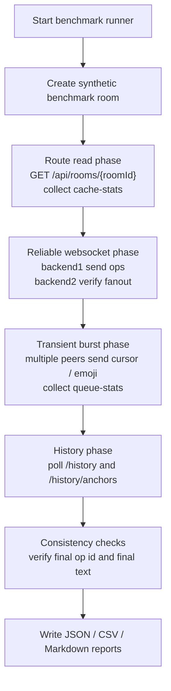

# 分布式压测与一致性校验说明

本仓库新增了一套独立的分布式基准测试工具，用来做三件事：

1. 自动发起 HTTP 与 WebSocket 压测
2. 自动抓取节点、缓存、队列、历史等统计数据
3. 自动执行一致性校验，并把结果整理成 `json / csv / md`

主入口：

```bash
node scripts/distributed-benchmark-report.mjs
```

Windows 也可以直接使用：

```powershell
powershell -ExecutionPolicy Bypass -File scripts/run-distributed-benchmark.ps1
```

## 测试目标

测试关注的是集群行为是否可观测、可验证、可汇报。

覆盖点包括：

1. 路由与缓存性能
   对同一测试房间重复发起 `GET /api/rooms/{roomId}`，记录延迟，并抓取 `cache-stats` 前后变化。

2. 多节点可靠写入性能
   固定通过 `backend1` 发送白板操作，让 `backend2` 接收广播，记录：
   - 首次 ack 延迟
   - 首次跨节点 fanout 延迟
   - 连续写入吞吐
   - 队列指标变化

3. 瞬时消息压力
   多个 peer 并发发送 `cursor` / `emoji` 这种 transient 消息，用于观察：
   - 队列峰值
   - transient drop
   - overload disconnect

4. 历史接口性能
   在已经写入真实测试数据之后，重复读取：
   - `/api/rooms/{roomId}/history`
   - `/api/rooms/{roomId}/history/anchors`

5. 一致性校验
   不是只看性能，还会验证：
   - 首条操作是否跨节点送达
   - 最后一条操作是否跨节点送达
   - `history` 是否包含最后一次写入的操作
   - `history` 是否包含最后一次写入的文本
   - 重复读取 `history` 时结果是否稳定

## 测试逻辑



### 1. 创建独立测试房间

脚本会自动创建一个新的 benchmark 房间，避免污染正常演示房间。
后续所有 HTTP、WebSocket、history 查询都围绕这个测试房间进行。

### 2. 路由读取阶段

脚本连续请求同一个房间详情接口，并记录每次请求耗时。
同时读取 `cache-stats`，对比请求前后的：

- requestCount
- hitCount
- missCount
- hitRate

这一阶段的目的，是给“分布式路由 + 缓存行为”一个基础性能侧写。

### 3. 可靠写入阶段

脚本建立两个 WebSocket 连接：

- `backend1` 负责发送操作
- `backend2` 负责接收跨节点广播

随后执行：

1. 发送第一条操作
2. 等待发送端收到 `op-ack`
3. 等待接收端收到跨节点广播
4. 连续发送多条 update 操作
5. 统计 ack 延迟分布与总体吞吐

这一阶段既是性能测试，也是分布式传播的第一层一致性检验。

### 4. 瞬时消息阶段

脚本创建多个 peer，交替连接 `backend1` / `backend2`，然后并发发送：

- `cursor`
- `room-emoji`

这类消息不要求持久化，重点是观察系统在 burst 流量下的行为：

- 队列是否堆积
- 是否开始丢弃 transient 消息
- 是否触发过载断连

### 5. 历史读取与一致性阶段

可靠写入阶段结束后，脚本会轮询 `history`，直到看到足够多的操作。
然后进行两类检查：

1. 性能检查
   多次读取 `history` 与 `history/anchors`，统计平均延迟和 p95。

2. 一致性检查
   将最后一次写入的操作 ID 与文本内容，同 `history` 全量结果对比；
   再把多次 `history` 读取结果互相对比，确认读出的最终状态稳定。

## 结果文件

每次运行都会在 `artifacts/distributed-benchmark/` 下生成真实结果文件：

- `benchmark-<timestamp>.json`
  原始结构化结果，适合程序继续分析。
- `benchmark-<timestamp>.csv`
  单次测试汇总，适合导入 Excel 或表格。
- `benchmark-<timestamp>.md`
  面向课程汇报和验收的可读报告。
- `latest.json`
- `latest.csv`
- `latest.md`
  永远指向最近一次测试结果。
- `benchmark-history.csv`
  累积多次测试结果，便于横向对比。
- `latest-run.log`
  记录每个阶段的执行进度，便于排查卡点。

## 默认负载

默认参数偏向“本地可稳定复现”，不是极限压测：

- `80` 次路由读取
- `61` 次可靠写入操作
- `6` 个 burst peer
- 每个 peer `40` 条 transient 消息
- `10` 次 history / anchors 查询

可以通过环境变量覆盖：

```bash
COCANVAS_BENCHMARK_LABEL=demo-baseline
COCANVAS_BENCHMARK_ROUTE_REQUESTS=200
COCANVAS_BENCHMARK_SEQUENTIAL_OPS=200
COCANVAS_BENCHMARK_BURST_PEERS=12
COCANVAS_BENCHMARK_BURST_MESSAGES=120
COCANVAS_BENCHMARK_HISTORY_REQUESTS=30
COCANVAS_BENCHMARK_OUTPUT_DIR=artifacts/distributed-benchmark
```

## 运行前提

运行前需要满足：

1. Cocanvas 本地 Docker 栈已经启动
2. `http://localhost:8088/api/health` 可访问
3. Nginx 暴露以下 WebSocket 路径
   - `/ws/backend1/collab`
   - `/ws/backend2/collab`

## 如何解读结果

最值得在课程汇报里引用的是这些字段：

- `routeReads.latency`
  体现路由查询和缓存访问的时延分布。
- `routeReads.cacheDelta`
  体现 cache hit / miss 的变化。
- `reliableWs.firstFanoutMs`
  体现首次跨节点同步代价。
- `reliableWs.throughputOpsPerSecond`
  体现可靠写入吞吐。
- `transientBurst.queueDelta.transientDrops`
  体现高并发瞬时消息下是否开始丢包。
- `transientBurst.queueDelta.overloadDisconnects`
  体现系统是否触发自我保护。
- `historyReads.consistency`
  体现最终写入是否已经出现在历史结果里，以及重复读取是否稳定。

## 说明

- 所有测试数据都由脚本自动生成，不依赖线上数据。
- 所有结果文件都来自真实运行，不是静态样例。
